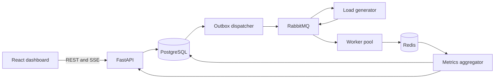

# Dispatch — Distributed Job Processing System

Dispatch is a full-stack platform for generating reproducible workloads, distributing jobs across asynchronous workers, and explaining system behavior through live and historical metrics.

It is designed as a production-oriented distributed-systems reference: reliable publication through a transactional outbox, at-least-once job delivery, delayed retries, dead-letter handling, atomic live aggregation, persistent reports, health checks, and containerized deployment.

## What you can explore

- Start controlled runs containing 10,000, 100,000, or 1,000,000 real jobs.
- Model a 100,000,000-job run in explicitly labelled simulation mode.
- Configure workload duration, failure probability, retry count, producer concurrency, and target rate.
- Watch queue depth, worker activity, throughput, completion, and errors live.
- Inspect P50, P95, and P99 processing latency.
- Review stored charts and evidence-based bottleneck suggestions after completion.
- Compare audit, aggregated benchmark, and extreme-scale simulation modes.

## Architecture



Read the [architecture overview](docs/architecture/overview.md) and [architecture decisions](docs/decisions/) for the reliability model and trade-offs.

## Technology

**Backend:** Python 3.12, FastAPI, SQLAlchemy 2, PostgreSQL, RabbitMQ, Redis, Alembic, Pydantic, aio-pika, Prometheus and structlog.

**Frontend:** React, TypeScript, Vite, TanStack Query, Recharts and Server-Sent Events.

**Engineering:** Docker Compose, multi-stage Docker builds, pytest, Vitest, Ruff, mypy and GitHub Actions.

## Run locally

Requirements: Docker Engine with Compose v2.

```bash
cp .env.example .env
docker compose up --build --scale worker=4
```

Open:

- Dashboard: <http://localhost:3000>
- OpenAPI documentation: <http://localhost:8000/docs>
- RabbitMQ management: <http://localhost:15672> (`job_platform` / `job_platform`)
- Prometheus: <http://localhost:9090>
- Grafana: <http://localhost:3001> (`admin` / `admin`)

Stop the stack without deleting data:

```bash
docker compose down
```

Delete local volumes as well:

```bash
docker compose down --volumes
```

## Run a benchmark

Use the dashboard or create a run directly:

```bash
curl -X POST http://localhost:8000/api/v1/runs \
  -H 'Content-Type: application/json' \
  -d '{
    "name": "100k light I/O",
    "job_count": 100000,
    "mode": "benchmark",
    "producer_concurrency": 20,
    "target_rate": 5000,
    "workload": "io_light",
    "duration_ms": 25,
    "failure_probability": 0.01,
    "max_retries": 3
  }'
```

The API request creates one benchmark command. The load generator—not the browser—publishes individual jobs at controlled concurrency. This prevents the browser or public API from becoming the accidental load-test target.

## Reliability characteristics

- PostgreSQL transaction atomically creates a benchmark and its outbox event.
- The dispatcher uses RabbitMQ publisher confirmations before marking an event published.
- Queues and messages are durable.
- Workers acknowledge deliveries only after processing.
- Failed work uses TTL-backed retry queues before entering a dead-letter queue.
- Redis counters are atomic and disposable; final snapshots remain in PostgreSQL.
- Worker heartbeats expire automatically so stale processes are not reported as active.
- Cancellation state is shared through Redis.

The processing guarantee is **at least once**. Real handlers must be idempotent because a worker can finish its side effect and fail before acknowledging the delivery.

## Development commands

```bash
make test
make lint
make frontend-test
make logs
```

## Responsible benchmarking

The default deployment limits real runs to one million jobs. A one-hundred-million selection is simulation mode, clearly identified in the interface. Raising limits requires infrastructure sized for the resulting broker traffic, storage, network usage, and cost. Never point load generation at systems you do not own or have permission to test.

## Project status

The repository contains the first complete vertical slice: benchmark configuration, reliable dispatch, workload generation, custom workers, retries, dead letters, live aggregation, persisted snapshots, React visualization, observability services, containers, tests, and CI. Future releases can add authentication, organization-level tenancy, richer per-job audit views, and externally managed production infrastructure.

