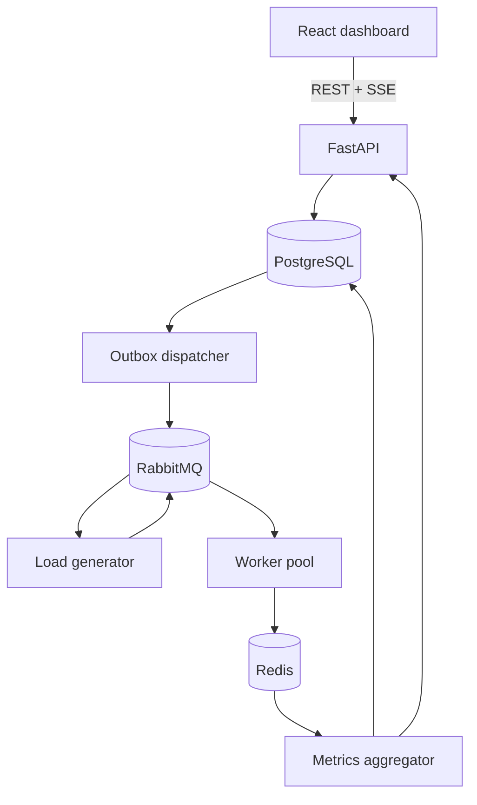

# Dispatch — Distributed Job Processing System

A full-stack distributed job-processing platform built to demonstrate reliable asynchronous work, controlled load generation, real-time observability, retries, dead-letter handling, and reproducible performance analysis.

Dispatch lets you create runs containing thousands to millions of jobs, distribute them across a worker pool, and watch the system behave in real time. Completed runs remain available as historical reports with throughput, latency, errors, worker activity, and bottleneck analysis.

## Try it in GitHub Codespaces

You do not need to install Python, Node.js, Docker, PostgreSQL, Redis, or RabbitMQ locally.

1. Click **Open in GitHub Codespaces** above.
2. Sign in to GitHub if requested.
3. Choose **Create codespace**.
4. If GitHub asks whether you trust the repository, select **Yes, I trust the authors**.
5. Wait while the environment builds and starts the complete platform.
6. Open the frontend URL printed in the terminal.

The Codespace intentionally does not open the website automatically. Its startup can finish before the terminal becomes visible while the trust prompt is waiting, so the printed message may occasionally be missed.

If you do not see the URL:

1. Open the VS Code **Ports** tab at the bottom.
2. Find **Dispatch frontend** on port **3000**.
3. Select its globe icon or **Open in Browser**.

The frontend address ends in `-3000.app.github.dev`. Port 8000 is the backend API, not the main website.

Startup creates private random credentials, launches four workers, waits for the API and frontend health checks, and prints direct service links in the terminal. The same links are printed again whenever you reconnect to the Codespace.

See the [complete Codespaces guide](docs/codespaces.md) for startup behavior, service URLs, restarts, troubleshooting, and cleanup.

## What you can do

- Run 10,000, 100,000, or 1,000,000 real asynchronous jobs.
- Model 100,000,000 jobs using explicitly labelled simulation mode.
- Choose audit, benchmark, or simulation execution modes.
- Configure workload type, job duration, failure probability, retries, producer concurrency, and target rate.
- Observe queue depth, completion, worker activity, throughput, retries, failures, and latency in real time.
- Review completed runs without charts continuing to collect flat, post-completion samples.
- Cancel and delete runs, including work that is currently queued or executing.
- Inspect automated, evidence-based bottleneck suggestions.
- Explore Prometheus metrics, Grafana dashboards, RabbitMQ management, and FastAPI documentation.

## How it works

A run is created transactionally with an outbox event. The dispatcher publishes that event with broker confirmation. The load generator produces deterministic jobs at controlled concurrency, and workers process them using at-least-once delivery. Redis maintains fast live state while PostgreSQL preserves durable run definitions and final reports.

## Technology

| Area | Technology |
| --- | --- |
| Backend | Python 3.12, FastAPI, SQLAlchemy 2, Alembic, Pydantic |
| Messaging and data | RabbitMQ, Redis, PostgreSQL |
| Frontend | React, TypeScript, Vite, TanStack Query, Recharts, SSE |
| Observability | Prometheus, Grafana, structured logging |
| Engineering | Docker Compose, pytest, Vitest, Ruff, mypy, ESLint, GitHub Actions |

## Documentation

The main README is intentionally concise. Detailed explanations are separated by responsibility:

| Document | Contents |
| --- | --- |
| [Codespaces guide](docs/codespaces.md) | One-click startup, URLs, lifecycle, and troubleshooting |
| [System architecture](docs/architecture/overview.md) | Components, data flow, delivery model, and scaling boundaries |
| [Backend](docs/backend.md) | API, services, workers, persistence, retries, and cancellation |
| [Frontend](docs/frontend.md) | Dashboard structure, live updates, charts, and state management |
| [Infrastructure and observability](docs/infrastructure.md) | Docker services, networking, health checks, Prometheus, and Grafana |
| [Benchmarking model](docs/benchmarking.md) | Modes, workloads, accounting invariants, and responsible usage |
| [Testing and CI](docs/testing.md) | Test layers, quality gates, audits, and GitHub Actions |
| [Architecture decisions](docs/decisions/0001-messaging-and-storage.md) | Why RabbitMQ, Redis, and PostgreSQL have distinct responsibilities |
| [Contributing](CONTRIBUTING.md) | Development workflow and quality commands |
| [Security](SECURITY.md) | Intended security scope and vulnerability reporting |

## Project scope

Dispatch is a portfolio and distributed-systems reference project. It demonstrates production-oriented patterns, but the default deployment is intentionally a private development environment. Authentication, authorization, tenant isolation, TLS termination, and public abuse controls would be required before exposing it as an unrestricted internet service.

Real processing is limited to one million jobs by default. The 100-million-job option is a simulation so the architecture can be explored safely within a Codespace.

## License

Licensed under the [MIT License](LICENSE).
